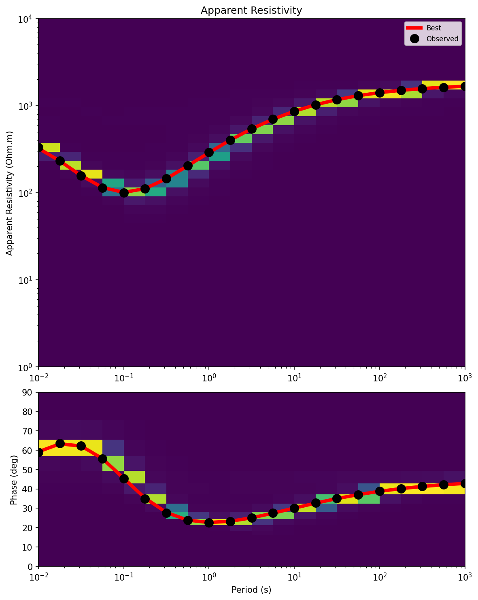
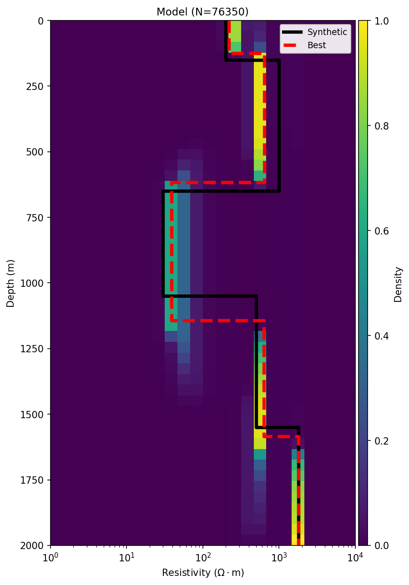

# Parallel Neighborhood Algorithm (NA) for 1D Magnetotelluric (MT) Data Inversion & Uncertainty Analysis

[](https://www.python.org/)
[](https://opensource.org/licenses/MIT)

<p align="center">
  
  
</p>

<p align="center">
  
</p>

This repository contains a high-performance Python implementation of the *Neighborhood Algorithm* (Sambridge, 1999). It is optimized using multi-core parallelization (`joblib`) and Just-In-Time compilation (`Numba JIT`) for 1D Magnetotelluric (MT) data inversion and uncertainty quantification.

Core algorithm framework adapted from: `https://github.com/auggiemarignier/neighpy`

##  Key Features ⏳

- **Fast Search Stage (Numba JIT):** Accelerates the MT forward modeling function using the `@njit(parallel=True, fastmath=True)` decorator for high-speed machine compilation.
- **Multi-Core Walkers:** Distributes the random walk sampling computation across all logical CPU processors using the `joblib` parallel architecture.

##  System Requirements & Installation 💻

### Prerequisites
- Python 3.9 or Python 3.10

### Installation Steps 

1. Clone this repository to your local machine:
   ```bash
   git clone https://github.com/ipul122/paralel-neighborhood-algorithm.git
   cd paralel-neighborhood-algorithm
2. Install all required dependencies via the requirements.txt file:
   ```bash
   pip install -r requirements.txt
3. To run the Neighborhood Algorithm (Global Inversion & Uncertainty Analysis):
   ```bash
   python main.py
4. To run the Levenberg-Marquardt Inversion (Gradient-based Local Inversion):
   ```bash
   cd LM
   python main.py
   
## Field Data File Setup 💾


Before running the inversion algorithms, you must supply your observed field data. You can automatically parse standard industry .edi files or set up the text file manually.

### Option A: Automatic Extraction via Drag & Drop (Recommended)
You can instantly convert raw .edi files into the proper inversion input format using the load_edi.py script located inside the MT/ folder:

1. Navigate to the MT directory:
   ```bash
   cd MT
2. Call the script and drag & drop your target .edi file directly from Windows Explorer into your terminal window before pressing Enter:
   ```bash
   python load_edi.py <drag_and_drop_your_edi_file_here>
The interactive CLI will read the data and prompt you: Masukkan nama file output (...).

Type your desired inversion input and press Enter. The script will save the formatted data and generate a matplotlib pop-up window of the Invariant curves.

### Option B: Manual Text File Setup
If you prefer manual setup, create a tab-separated (\t) text file named CUSTOM_NA.txt (for Neighborhood Algorithm) or CUSTOM_LM.txt (for Levenberg-Marquardt) inside the MT/ directory.

The text structure must omit the default numpy comment character (#) on the header and strictly follow this 3-column setup:
  ```ini
  Frequency(Hz_sitename)	AppRes(Ohm.m)	Phase(deg)
  100.00000000        	150.23456789 	45.12345678
  50.00000000         	145.65432101 	46.78901234
  ... [sequential frequencies from high to low]
  ```
## Config Settings  
1. Open and edit the field data file using nano:
   ```bash
   nano config.txt

2. set Param:
   ```ini
   [SETTINGS]
   nr = 10
   ns = 150
   ni = 1500
   iter = 100
   seed = None
